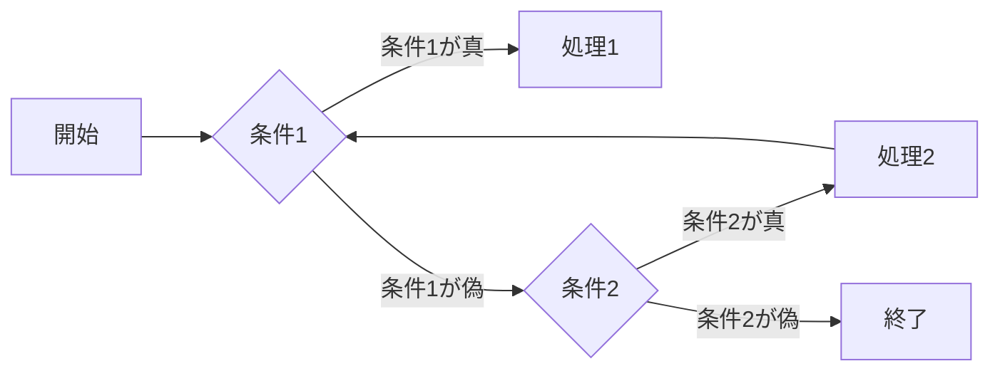
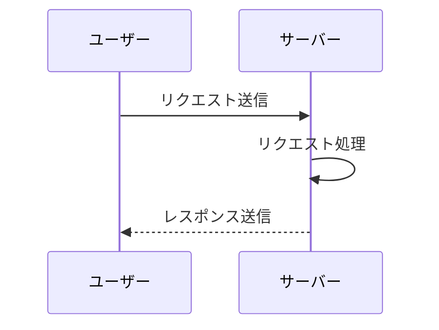
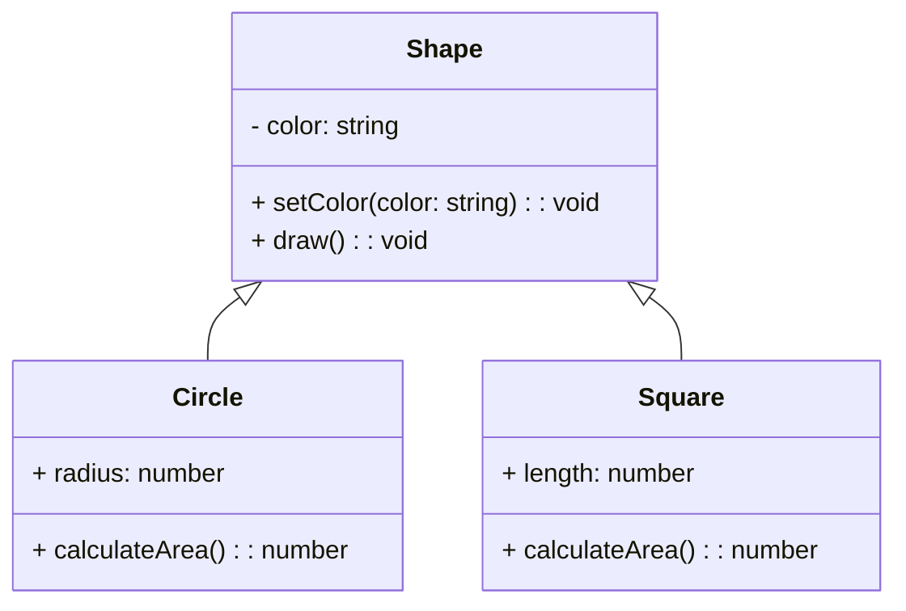
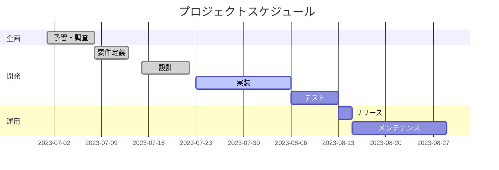

#### mermaidで記述できるダイアグラム 
1. フローチャート
###### 例


## code
``` c
graph LR
    A[開始] --> B{条件1}
    B -- 条件1が真 --> C[処理1]
    B -- 条件1が偽 --> D{条件2}
    D -- 条件2が真 --> E[処理2]
    D -- 条件2が偽 --> F[終了]
    E --> B
```
---
2.シーケンス図
###### 例


## code
```c
sequenceDiagram
    participant A as ユーザー
    participant B as サーバー
    A->>B: リクエスト送信
    B->>B: リクエスト処理
    B-->>A: レスポンス送信
```

---
3. クラス図
###### 例


## code
```c
classDiagram
    class Shape {
        - color: string
        + setColor(color: string): void
        + draw(): void
    }
    class Circle {
        + radius: number
        + calculateArea(): number
    }
    class Square {
        + length: number
        + calculateArea(): number
    }
    Shape <|-- Circle
    Shape <|-- Square
```
---
4. ガントチャート
###### 例


## code
```c
gantt
    dateFormat YYYY-MM-DD
    title プロジェクトスケジュール
    section 企画
    予習・調査: done, 2023-07-01, 7d
    section 開発
    要件定義: done, 2023-07-08, 5d
    設計: done, 2023-07-15, 7d
    実装: active, 2023-07-23, 14d
    テスト: , 2023-08-06, 7d
    section 運用
    リリース: , 2023-08-13, 2d
    メンテナンス: , 2023-08-15, 14d
```

