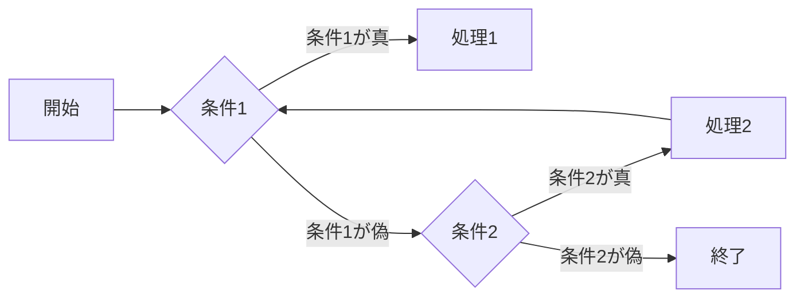
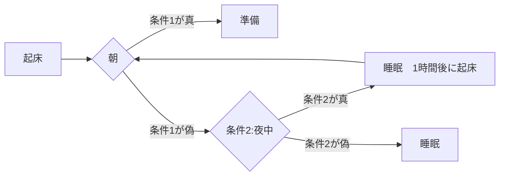
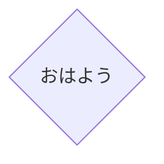
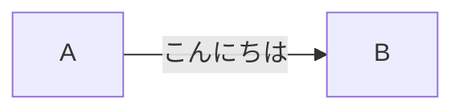

1. フローチャート


#####例

---
ノードの作成

```
#code
graph LR
    A
```
---
ノードをひし形にする

```
#code
graph LR
    A{"おはよう"}
```
---
矢印で結ぶ

```
#code
graph LR
    A-->B
```
---
矢印の上にテキストを作成

```
#code
graph LR
    A--"こんにちは"-->B
```