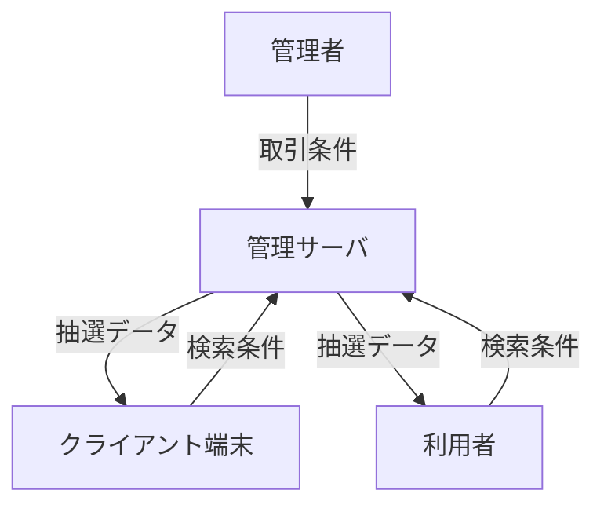

## システム全体図

```mermaid
graph TD;
    管理サーバ-->|抽選データ|クライアント端末;
    クライアント端末-->|検索条件|管理サーバ;
    管理サーバ-->|抽選データ|利用者;
    利用者-->|検索条件|管理サーバ;
    管理者-->|取引条件|管理サーバ
```
##### 利用者操作
・初めて利用する場合は、ユーザ登録を行う
・ブラウザによりログインして利用する
・ブラウザを利用して、条件を入力し情報を取得する
#####　管理者操作
・ブラウザによりログインして利用する
・ブラウザにより企業情報を登録・保守を行いデータベースを管理する